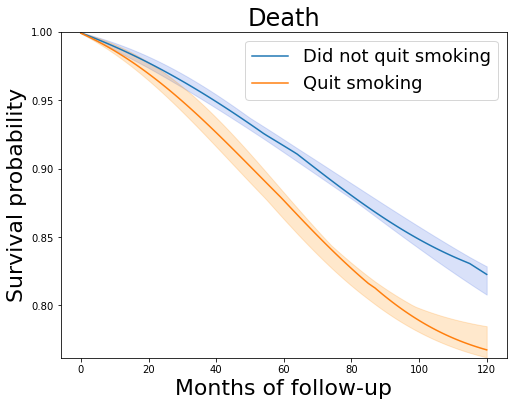

## Python code for Causal Survival Analysis

This repository contains a python class _Survival_Analysis_, which allows estimation of survival curves 
following the frameworks described in the book: _Causal Inference: What If_, by Miguel Hernán and James Robins ([book site](https://www.hsph.harvard.edu/miguel-hernan/causal-inference-book/)).

The class allows the user to estimate and plot survival curves, using pooled logistic regression models, using the following methods: \
* Inverse-Probability-Weighting 
* Overlap-Weights
* Standardization

### Usage and data
A usage exmaple can be found in the notebook _NFEHS example.ipynb_. \
Code for this example can be downloaded [here](https://cdn1.sph.harvard.edu/wp-content/uploads/sites/1268/1268/20/nhefs.csv). \
Code in this notebook assumes the data in a csv format is located under the _data_ folder.

### Python requirements
Required Python packages:
* numpy
* matplotlib
* seaborn
* sklearn
* pandas
* tqdm
* statsmodels
* math

### Authors
Ayya Keshet and [Hagai Rossman](https://github.com/hrossman)
